# Arrow (LoOper) — Technical Architecture & Codebase Reference

Arrow is a Windows desktop platform for building, running, and scheduling intelligent automation entirely on local hardware: record any interaction once, compose it into a visual workflow graph, and execute it deterministically — with local AI (llama.cpp / Ollama), local vision, local OCR, and local speech. No cloud, no telemetry, no per-token fees.

This document is the **technical reference** for the current codebase: architecture, every subsystem, the frameworks it is built on, the data formats it reads and writes, and the engineering doctrine behind its implementations. The internal package name is still `LoOper`; the product brand is **Arrow**.

---

## Contents

1. Platform overview
2. Technology stack
3. High-level architecture
4. Runtime topology
5. The chain workflow model (nodes, ports, data flow)
6. The execution engine
7. Recording subsystems (desktop + web)
8. Playback & grounding (desktop + web)
9. AI stack (inference, retrieval, vision, speech)
10. Agent mode (system chains, tools, orchestrator, deterministic chains, goals, routing shadows)
11. Memory & context
12. Specialized subsystems (form filler, handle, MCP, code)
13. Scheduling, sandbox & remote access
14. Export & build pipeline
15. Configuration, environment & data
16. Engineering doctrine (methodologies)
17. Testing & verification
18. Repository layout
19. Licensing & distribution

---

## 1. Platform overview

### 1.1 What Arrow is

- **A visual automation platform.** Workflows ("chains") are node graphs, not scripts. Recorded desktop sequences and browser flows are first-class nodes you connect, branch, loop, and nest.
- **A deterministic execution engine with embedded AI.** The graph is a symbolic program; LLM nodes, conditional gates, decision inputs, and the orchestrator add fuzzy reasoning only at the seams. Nothing critical depends on a model producing well-formed output.
- **An agent platform.** Agent Mode turns chains into tools for a local model. The agent's "mind" is a **system chain** you design in the editor — up to and including an **Orchestrator root** that routes a goal across multiple mini-brain chains until it is achieved.
- **Fully on-device.** Bundled GGUF models via llama.cpp, ONNX vision, PaddleOCR, Piper TTS, Vosk STT. Works offline and in air-gapped environments.
- **Composable approval and memory primitives.** Approvals are Input nodes plus branch routing; memory is Context nodes plus an inspectable SQLite store and Graph RAG.

### 1.2 Capability map

| Capability | What it does | Primary code |
|---|---|---|
| Node-graph editor | Author, edit, expand, and run chains | `NGUI/` (PyQt5 + NodeGraphQt) |
| Desktop recorder | Capture clicks, typing, scrolls, drags, clipboard + screenshots + UIA elements | `recorder/`, `NGUI/widgets/recording_overlay.py` |
| Web recorder | DOM-level browser capture via CDP injection; selector-based sessions | `player/web/` (recorder, picker, inject) |
| Execution engine | Dependency-gated scheduler loop over typed nodes; branches, loops, sub-chains | `player/multi_sequence_player.py`, `player/multi_sequence/worflow_interpreter_modules/` |
| Desktop replay | Element-first (UIA) + template-matching cascade, OCR conditions, human-like pacing | `player/action_handlers.py`, `player/computer_vision.py`, `player/uia_locator.py`, `player/ocr_engine.py` |
| Web replay | Native-first CDP ladder, durable shared browser profile, entity-driven | `player/web/engine.py`, `player/web/handlers/` |
| Local AI | llama.cpp GGUF + Ollama; chat/generate/embed endpoints | `AI/llama_cpp_engine.py`, `AI/ollama_engine.py`, `AI/api.py` |
| Semantic retrieval | ComoRAG probe-driven retrieval; embeddings; Graph RAG | `AI/comorag_engine.py`, `AI/embedding_server.py`, `AI/graph_rag.py` |
| Laya engine | Embedded System-1 decision engine (typed choice/score/noul, CPU) | `AI/laya_client.py`, `AI/laya_hooks.py`, `AI/laya_bench.py`, `AI/bin/laya.exe`, `AI/models/laya-GGUF/` |
| Vision | VLM screen understanding (LFM2.5-VL), ONNX object detection, PaddleOCR | `AI/recursive_vision_reasoner.py`, `player/computer_vision.py`, `player/ocr_engine.py` |
| Speech | Piper neural TTS, Vosk STT (voice mode) | `player/tts_engine.py`, `player/stt_engine.py` |
| Agent mode | System-chain-driven agent; chat overlay; phone client; chains-as-tools | `player/agentic_ops/`, `NGUI/widgets/agent_overlay.py`, `NGUI/widgets/agent_web_server.py` |
| Orchestrator | Goal loop over mini-brain chains; LLM/Laya picker; trace + synthesis | `player/…/executor_modules/orchestrator_ops.py`, `NGUI/nodes_resources/orchestrator_node.py` |
| Persistent goals | Wake-driven goal ledger; blocked lifecycle | `player/agentic_ops/goal_ledger.py` |
| Memory | Turn-based in-run context + SQLite persistence + RAG + consolidation | `port_store.py`, `AI/context_database.py`, `context_ops.py` |
| Scheduling | once / daily / weekly / interval, JSON-persisted, in-process runs | `NGUI/scheduler_service.py` |
| RDP sandbox | Run automation inside an isolated Windows session | `sandbox_agent.py`, `setup_rdp_agent.py`, `utils/rdpwrap/` |
| Agent export | Compile a system chain + transitive assets into a standalone exe | `builder/agent_exporter.py`, `builder/agent_standalone_entry.py` |
| Licensing | Offline HMAC-signed license files bound to hardware | `keygen/` |

---

## 2. Technology stack

### 2.1 Core frameworks

| Domain | Technology |
|---|---|
| Language / runtime | Python ≥ 3.10 (Windows), `multiprocessing`, threads + Qt event loop |
| Desktop UI | **PyQt5** (dark theme, high-DPI), **NodeGraphQt** (graph editor), `pytablericons` (vector icons), `i18n` (EN/ES) |
| Local HTTP API | **FastAPI** + **uvicorn** (chat, generate, embeddings, llama.cpp lifecycle, vision bootstrap) |
| LLM inference | **llama.cpp** (bundled `llama-server.exe`, GGUF, Vulkan backends) and **Ollama** (HTTP) |
| Embeddings | Dedicated llama.cpp embedding mode (`embeddinggemma-300M GGUF`) |
| Desktop input | `pynput` / low-level Windows hooks, `PyAutoGUI`, `pyperclip`, `keyboard` |
| Computer vision | **OpenCV** (multi-scale template matching), `mss` (capture), Pillow, scikit-image, SciPy |
| Detection / OCR | **ultralytics ONNX YOLO** object detection, **PaddleOCR** (det/rec/cls) |
| Vision-Language | LFM2.5-VL (450M GGUF + projector) via `llama-mtmd-cli` |
| Web automation | **Selenium** + **undetected-chromedriver**, CDP (Chrome DevTools Protocol) injection, `websocket-client` |
| Speech | **Piper** (ONNX neural TTS), **Vosk** (Kaldi-based offline STT) |
| Memory / data | **SQLite** (`SQLAlchemy`), JSON files, atomic tmp+replace writes |
| System-1 decisions | **Laya** (ModernBERT-large, typed noul/choice questions, one encoder pass), embedded CPU runtime |
| Documents | `PyPDF2` (PDF extraction), `python-docx` (Word) |
| Packaging | **PyInstaller** (onedir), **WiX Toolset** (per-user MSI), PowerShell build pipeline |
| Security | `cryptography` (offline HMAC license validation) |

### 2.2 Optional dependency extras (`pyproject.toml`)

| Extra | Contents | When |
|---|---|---|
| `vision` | torch, torchvision, sentence-transformers, ultralytics (Python < 3.13) | Full vision/ML stack on the MSI |
| `vision313_win` | torch, torchvision (Python 3.13+, Windows) | Vision support on newer Pythons |
| `overwatch` | FastAPI, LangChain, loguru, pandas… | OverWatch companion service and its utilities |

Web automation dependencies (`selenium`, `undetected-chromedriver`, `keyboard`) are declared in `LoOper/requirements.txt`; everything else is pinned in `pyproject.toml`.

---

## 3. High-level architecture

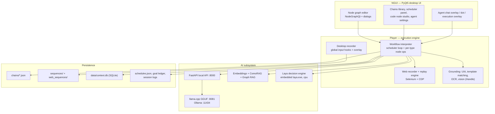

**The three pillars:**

1. **NGUI** — the editor and all runtime surfaces (overlays, panels). Graph authoring with typed nodes, dialogs for configuration, chain library with collections, scheduler UI, and the agent chat/phone surfaces.
2. **Player** — the execution engine and all input/output machinery: the workflow interpreter (builder → executor → navigator), the desktop recorder, the web recorder/replay engine, and the grounding stack (UIA, template matching, OCR, vision).
3. **AI** — the local inference and retrieval stack: a FastAPI server exposing chat/generate/embed over llama.cpp and Ollama, the embedding server, ComoRAG/GraphRAG retrieval, and the embedded Laya decision engine.

---

## 4. Runtime topology

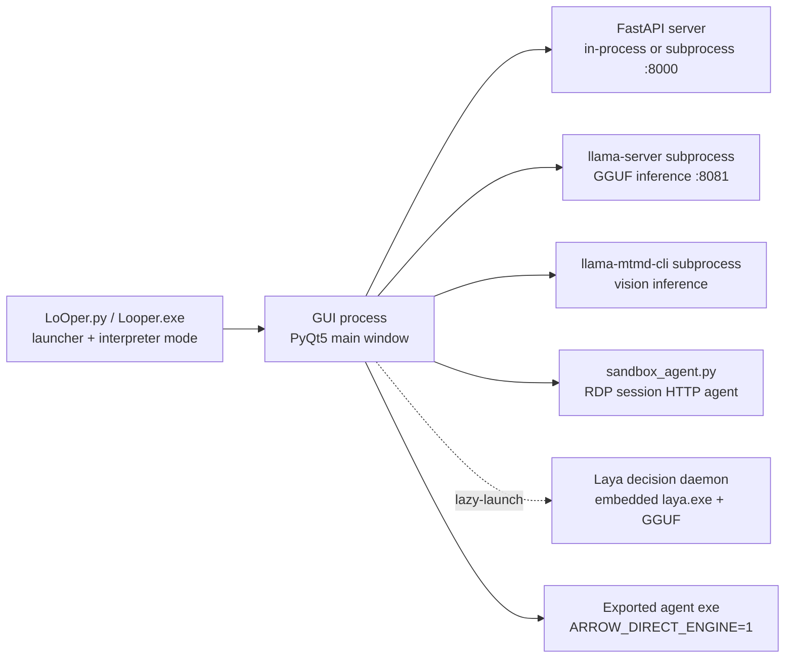

- **Launcher (`LoOper.py`)** — a bootstrap process that can run the GUI, or execute a `.py` argument directly (interpreter mode), which is how the RDP sandbox agent and exported agents are spawned.
- **GUI process** — PyQt5 main window; hosts the graph editor, overlays, scheduler thread, recorder listeners, and (by default) the FastAPI server.
- **llama.cpp subprocess** — the bundled `llama-server.exe` (default port 8081) serves all GGUF inference; engine lifecycle is managed by `AI/llama_cpp_engine.py` (start on demand, health-check, release).
- **Vision subprocess** — multimodal inference runs through `llama-mtmd-cli` with a GGUF + mmproj projector pair.
- **Laya engine** — embedded, lazy-launched daemon (`AI/bin/laya.exe` + `AI/models/laya-GGUF/`), `None` on failure; every consumer falls back to LLM paths automatically.
- **Exported agents** — standalone executables that embed the app, the system chain, and its transitive chains; they run with `ARROW_DIRECT_ENGINE=1` (no external API dependency at all).

---

## 5. The chain workflow model

### 5.1 Chain JSON format

A chain is a JSON document whose top-level sections each hold a list of typed nodes (the visual graph is stored as node lists + connections, not as an opaque blob):

| Section | Node type | Purpose |
|---|---|---|
| `sequences` | Sequence | Replay a recorded desktop sequence |
| `web_sequences` | Web Sequence | Replay a recorded browser session |
| `conditional_nodes` | Conditional | Branch on image / OCR / wait / web conditions (`true` / `false` ports) |
| `llm_nodes` | LLM | Local inference: reasoning, tools, vision, structured output, TTS |
| `chain_import_nodes` | Chain Import | Run another chain as a sub-workflow / tool |
| `form_filler_nodes` | Form Filler | Document-grounded multi-field form completion |
| `code_nodes` | Code | Custom Python with JSON in/out |
| `container_nodes` | Container | VM-based grouping node |
| `context_nodes` | Context | Persistent cross-chain memory |
| `input_nodes` | Input | Value injection, questions, decision routing, media acceptance |
| `handle_nodes` | Handle | Vision-based click/scroll/zoom grounding |
| `mcp_nodes` | MCP | Model Context Protocol server tools |
| `output_nodes` | Output | Expose results to the overlay / outside the chain |
| `orchestrator_nodes` | Orchestrator | Goal loop over mini-brain chains |
| `tts_nodes` | (legacy) | Auto-migrated into LLM nodes with TTS enabled |

Chain metadata: `name`, `description`, `collection` (e.g. `System`, `Tools`, `Brains`), and `is_default` (marks the default system chain).

```json
{
  "name": "My Chain",
  "collection": "Tools",
  "description": "What this chain does - used at runtime for tool descriptions",
  "llm_nodes": [ { "type": "llm", "label": "Reason", "node_id": "0x…", "connections": [] } ],
  "chain_import_nodes": [],
  "input_nodes": [],
  "output_nodes": []
}
```

### 5.2 Node catalog

| Node | Role | Notable behaviour |
|---|---|---|
| Sequence | Desktop replay unit | Loops, delays, per-action fallbacks |
| Web Sequence | Browser replay unit | Element-driven, never absolute coordinates |
| Conditional | Symbolic branch | Image/OCR/wait/web conditions; `true`/`false` ports; loop modes |
| Input | Value injector + interaction gate | Resolve cascade, decision routing, question modes, media |
| LLM | Reasoning node | Tools, vision, structured output, web mode, TTS, consolidation |
| Chain Import | Composition | Sub-chain in-player or as an LLM tool; classified *brain* (contains an orchestrator) vs *deterministic chain* |
| Form Filler | Structured data entry | Knowledge base + repair loops + review gate |
| Code | Extension point | Inline/file Python, JSON arguments, output variables |
| Container | VM grouping | Groups nodes into a sub-VM |
| Context | Memory | Turn-based history, SQLite persistence, consolidation |
| Handle | Vision action | VLM scene understanding + LLM reasoning for click/scroll/zoom |
| MCP | External tools | Discovered tools exposed to the router model |
| Output | Sink | Chat bubble / popup / agent-visible results |
| Orchestrator | Goal loop | Runs frozen deterministic chains first, else picks mini brains; synthesizes the final answer |

### 5.3 Ports and data flow

Every node exposes **named ports**. Execution flows along **exec edges** (base ports such as `output` → `input`); values flow along **data edges** (`data`, `true`/`false`, `trace`, `blocked`, `files`, `brains`, `chains`, …). The distinction is what keeps the engine predictable: a data edge never triggers execution, an exec edge never smuggles values.

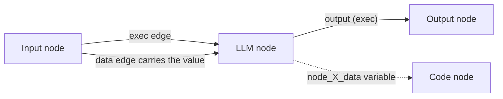

- All port values are stored per chain in the **PortScopedStore** and exposed as `node_<id>_<port>` variables; downstream nodes read only ports they are explicitly connected to.
- Chain-to-chain state rides explicit variables: `_chain_input_context` (the prompt channel into sub-chains), `selected_by_llm`, tool results, etc. There is no hidden global state between chains.
- Branch-capable nodes are: Conditional nodes, Input nodes with **decision mode**, and Input nodes with **routed yes/no questions**. They own `true` / `false` output ports.
- **Router ports make the source a subroutine.** A node whose execution edges land *only* on a router input port (`llm.tools`, `orchestrator.brains`, `orchestrator.chains`) is flagged `tool_provider` once at graph build — generically, for every node type, after stale edges are dropped — and never runs in the main loop: its router invokes it. `selected_by_llm` rides along as a dispatch/reporting marker, never as an execution grant.

### 5.4 Branching and loops

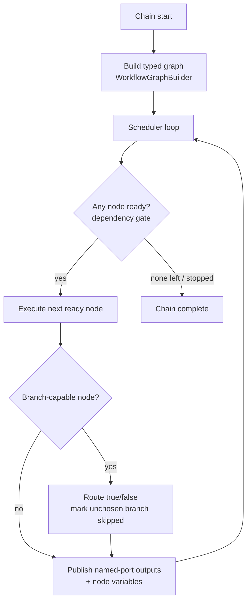

- Branch sweep: when a branch-capable node resolves, the unchosen branch is recursively **marked skipped** (shared `_mark_skipped` machinery) so merges never stall.
- Loop-backs re-inject context: an Input node re-resolves on every pass, which is how iterative workflows (search-refine, retry ladders) are built with pure topology.
- Decision and routed questions are re-evaluated per loop pass, keeping gates accurate inside iterating workflows.

---

## 6. The execution engine

### 6.1 Components

| Component | File | Responsibility |
|---|---|---|
| Entry | `player/multi_sequence_player.py` | Load + migrate a chain, preload caches, orchestrate one run |
| Builder | `…/worflow_interpreter_modules/builder.py` | Turn chain JSON into a typed graph dict (ports, edges, tool-provider gating) |
| Navigator | `…/navigator.py` | Decide the next node to execute from the ready set |
| Executor | `…/executor_modules/core.py` | The scheduler loop, dispatch, branch routing, skip sweep, stop flag |
| Per-type ops | `…/executor_modules/*_ops.py` | One module per node family (input, llm, chain, conditional, code, context, handle, mcp, form filler, orchestrator, output, sequence, container) |
| Dependencies | `…/executor_modules/dependencies.py` | Readiness gate: exec edges, data edges, branch-source rules |
| Port store | `…/executor_modules/port_store.py` | Named-port values + turn-based history per chain |

### 6.2 Execution semantics

- **Dependency-gated scheduling.** A node runs only when every incoming edge it needs is settled: exec edges fire in order, data edges only gate consumers that actually read them. Branch sweeps pre-settle the unchosen side so merges proceed.
- **Tool-provider gating.** Chain-import nodes wired to a tool consumer (LLM tools port, Orchestrator `brains` port) are *tool providers*: they never start the chain standalone, they only run when selected.
- **Stop semantics.** A single stop flag is polled everywhere (including inside model calls); ESC aborts a run immediately, and pending ask-user waits are released (the answer is discarded, not eaten by the next query).
- **Failure model is fail-closed.** Unparseable model answers route to the configured default branch; missing criteria fail without a model call; extraction errors degrade to logged fallbacks — never a crash, never a silent wrong turn.
- **Serialized model access.** LLM calls share one managed engine and a serialization lock; the engine is never preloaded at startup and is released after inactivity bursts. Local inference runs **without timeouts** — interruption is a stop-flag concern, not a timeout concern.

---

## 7. Recording subsystems

### 7.1 Desktop recorder

| Module | Role |
|---|---|
| `recorder/element_recorder.py` | Session coordinator; merges handlers into one action stream |
| `recorder/mouse_handler.py` | Click/drag detection (drag threshold, button identity) |
| `recorder/keyboard_handler.py` | Modifier tracking, hotkey recognition, text buffering |
| `recorder/scroll_manager.py` | Scroll-burst grouping into single actions |
| `recorder/screenshot_manager.py` | Cropped screenshot per click for visual grounding |
| `NGUI/widgets/recording_overlay.py` | On-screen recording controls + UIA element capture |

Capture policy highlights (all recorded alongside the action): the **cropped image** of the click target, the **Windows UIA element** the click landed on (ControlType + bounding box), and precise coordinates. The recorder groups rapid scrolls into one action, buffers typed text into one type action, and recognizes clipboard shortcuts. When the target is a browser and you record a Web Sequence node, the same workflow hands over to the web recorder (below) so browser steps are captured as DOM entities instead of images.

### 7.2 Web recorder

| Module | Role |
|---|---|
| `player/web/recorder.py` | Orchestrates a CDP recording session on a real, visible browser |
| `player/web/chrome_capture.py` | Chrome process/session capture and CDP bridge |
| `player/web/inject/recorder.js` | In-page event capture (clicks, typing, keys, scroll, popups) |
| `player/web/inject/picker.js` | Element picker used during recording |
| `player/web/inject/locators.js` | Selector derivation for recorded elements |
| `player/web/events.py` / `session.py` | Event schema + durable session storage |

Recordings are stored as **web sequences** (`web_sequences/*.json`): element-driven steps with selector identities, **never absolute coordinates**. Identity rules favour stable attributes (`data-*`, ids, text containment), exclude outer containers from repeating-element matches, and treat repeated items as entities with cursor semantics for replay.

---

## 8. Playback & grounding

### 8.1 Desktop replay — two independent locators

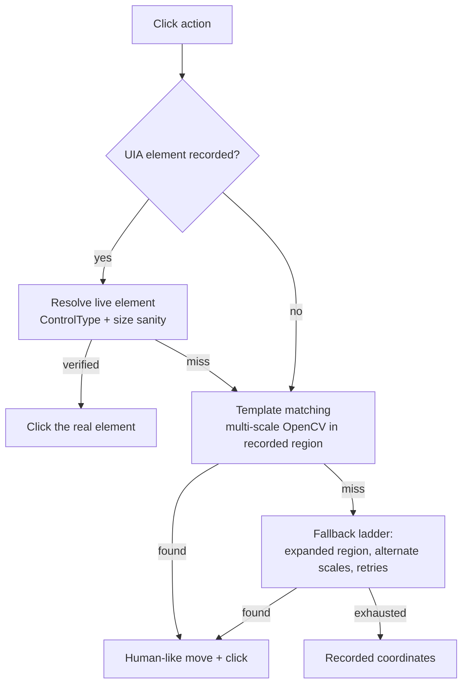

- **Element-first (Windows UI Automation)** — `player/uia_locator.py` resolves the recorded element's *live* bounding box, surviving moved windows, theme/DPI changes, and scrolled lists. Anti-misfire: a resolved element is trusted only when ControlType matches and the box is plausible.
- **Template matching** — `player/computer_vision.py` performs multi-scale OpenCV matching within region constraints and confidence thresholds; `action_handlers.py` owns the click cascade.
- **OCR conditions** — `player/ocr_engine.py` + `ocr_worker.py` (PaddleOCR) power text conditions in Conditional nodes.
- **Human-like behaviour** — jittered click targets, curved mouse paths, variable timing.

### 8.2 Web replay engine

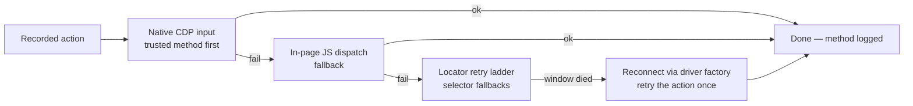

- One **handler class per action type** (`player/web/handlers/`: pointer, keyboard, focus, navigation, chrome); every handler runs the deterministic ladder and reports **which method worked**, so logs read `Web action 4 (click) OK via native`.
- Replay is **visible-browser by default** (headless is an opt-in flag) with human-like pacing; ESC cancel is honoured via the stop flag.
- **One shared durable Chrome profile** for the whole app: cookies/logins recorded once are present in every later run and survive restarts (pages are never restored).
- Web-dominant chains run through the DOM engine so web replay never captures the user's physical cursor; mixed topology (web nodes interleaved with control nodes) is routed accordingly.

---

## 9. AI stack

### 9.1 Inference engines

| Engine | Transport | Notes |
|---|---|---|
| **llama.cpp** | `llama-server.exe` subprocess, port 8081, HTTP | GGUF models, GPU-layer offload (Vulkan), embedding mode for the embedding server |
| **Ollama** | HTTP :11434 | Alternative provider; model pulled/selected by name |
| **llama-mtmd-cli** | subprocess per inference | Multimodal vision (GGUF + mmproj projector) |

`AI/model_cache.py` and `AI/model_downloads.py` manage model inventory and downloads; `AI/gguf_model_info.py` inspects GGUF geometry (context limits, layer counts) to size runtime parameters. The engine is authoritative about context size — the app caps requests to the model's training context.

### 9.2 Local API surface (`AI/api.py`, FastAPI)

| Endpoint | Purpose |
|---|---|
| `/health`, `/models`, `/bootstrap/status` | Liveness, model inventory, startup state |
| `/chat`, `/generate`, `/generate_stream` | Unified chat/generation (routes to the active provider) |
| `/embeddings` | Embedding vectors (embedding server) |
| `/llamacpp/*` (`chat`, `generate`, `generate_stream`, `start`, `stop`, `status`, `models`, `release`) | Direct llama.cpp lifecycle + inference |
| `/vision-models` | Vision model inventory |
| `/cleanup` | Free engines after bursts |

### 9.3 Embeddings & semantic retrieval

- `AI/embedding_server.py` — lazy thread-safe singleton: own llama.cpp embedding process, batching, health-check/restart, atexit shutdown.
- `AI/comorag_engine.py` — **ComoRAG** retrieval: the embedding space is used as a detached sparse attention layer over large context sources.

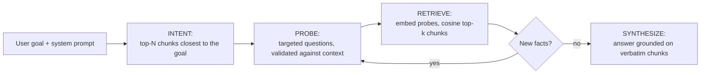

- `AI/graph_rag.py` — Graph RAG over stored context (nano-graphrag lineage): surfaces relevant past knowledge to reasoning nodes and records execution fragments so the agent can reason about what happened.
- `AI/laya_hooks.py` — the Laya verdicts wired into the ComoRAG pipeline **by default** (both for LLM nodes and for the form filler): **fact creation** (per-finding relevance verdict before a finding enters the memory pool), **probing assessment / consumption** (the sufficiency judge that ends the sweep with `ANSWER:` or keeps probing with `MISSING:`), and **choice picking** (`choose_option`, the form filler's semantic option rail — argmax with a confidence floor, `None` when no option clearly wins so the field is asked). Typed noul questions via the embedded engine, LLM evaluators as the fallback, `LOOPER_LAYA=off` back to LLM-only.

### 9.4 Laya System-1 decision engine

An embedded **typed-decision model** (Laya — the open reproduction of TypeSafe Jev: ModernBERT-large 421M, `noul`/`choice`/`score` questions answered in one encoder pass, no token generation) that answers the questions the pipelines used to ask a small LLM: *which worker fits this goal best*, *does this text satisfy this criterion*, *is this finding on topic* and *is the goal answerable yet*. It runs as a lazy-launched child process (`AI/bin/laya.exe daemon`, newline JSON-RPC on stdin/stdout — a ~1.7 MB self-contained CPU build) managed by `AI/laya_client.py`, and it is **always optional**: every consumer calls it once, gets `None` on any failure, and falls back to the LLM path. **Consumers, all Laya-first by default**: the Orchestrator picker (done-probe + worker-only choice + conservative ask, in `orchestrator_ops.py`), the Input-node decision evaluator, the ComoRAG fact-curation verdict + sufficiency judge (LLM nodes) and the form filler's field judge + finding curator (`AI/laya_hooks.py`, verdict correctness over latency — CPU-only, ~2 s/verdict on 12 threads). `AI/laya_bench.py` is the gate harness (brain-picking and decision benchmarks, exit codes for shipping Laya options on/off). A `LOOPER_LAYA=off` kill switch forces every consumer onto LLM paths (`LOOPER_JEV` is honored as the legacy name). The English quants ship in `AI/models/laya-GGUF/` (`ud_q4_k_m` default, `q8_0`, `f16`; `LOOPER_LAYA_MODEL` overrides) — the model loads once in ~2 s, deltas per verdict after that. **It is a burst resource, not a resident one**: the daemon starts on the first request and unloads once the burst ends (`LOOPER_LAYA_KEEP_ALIVE_SECONDS`, default 2 s), and `AI/llama_cpp_engine.LlamaCppEngine.start_server()` releases it before allocating the (much larger) llama-server model — on the native/APU builds the two share one memory pool, and measured 2026-09-23 a resident scorer collapsed the llama.cpp native context 262144 → 1024 tokens and OOM'd the Vulkan KV-cache allocation. The next request simply relaunches it (~2 s).

### 9.5 Vision & document understanding

| Layer | Technology | Used by |
|---|---|---|
| Screen VLM | LFM2.5-VL 450M + projector (mtmd) | Handle node scene understanding, vision LLM nodes |
| Object detection | ONNX YOLO-based detector (~44 MB) | UI element detection, click targeting supplements |
| OCR | PaddleOCR (det/rec/cls, bundled models) | Conditional text conditions, form filler, doc pipelines |
| Document extraction | PyPDF2 (PDF), python-docx (Word), txt | Input-node media, form filler grounding |

### 9.6 Speech

- **TTS** — Piper ONNX voices (`LoOper/data/piper_voices/`): spoken input prompts, spoken results, TTS-capable nodes with variable interpolation. Legacy standalone TTS nodes are auto-migrated into LLM nodes.
- **STT** — Vosk (`LoOper/data/vosk_models/`): voice mode for agent chat; transcriptions go through the same dispatch path as typed text.

---

## 10. Agent mode

### 10.1 The system chain is the agent's mind

Agent mode has **no hardcoded behaviour**. It requires a *system chain* (a chain with `collection: "System"`) that defines the entire cognitive architecture: Input nodes receive the query, LLM nodes reason, Context nodes remember, Chain Import nodes act as tools, Output nodes surface the answer. Multiple system chains = multiple named agents with different roles.

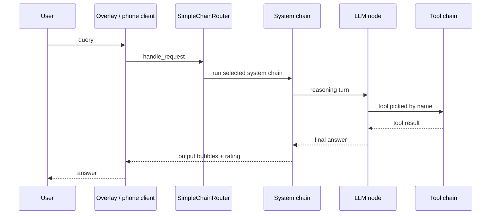

- **Dispatch** (`player/agentic_ops/simple_agent.py`) selects the default system chain (`is_default`) or first System chain, then executes it through the same engine as manual playback.
- **Chains-as-tools**: any chain connected to an LLM's tools port is selectable at runtime; tool descriptions are **runtime-derived** from the chain's description and inputs — never persisted stale.
- **Stepped protocol for small models**: the router picks a tool by name (a bare token or short alias — never nested JSON); each agent-modifiable Input node then extracts its own single value with one focused call. One tiny selection + N tiny extractions replaces one schema-shaped tool call — that is why a 3B model suffices.
- **Ask-user v2**: any Input node with a prompt pauses the run and asks through the richest available channel — chat overlay with buttons for yes/no or multiple choices, attach/paste affordances for documents and images — answerable from desktop **or phone**; a reply that names a file becomes an attachment. Legacy ask-user consumers (form filler) keep working unchanged.
- **Activity memory & memory-only chat** — `player/agentic_ops/run_memory.py` keeps ONE append-only SQLite timeline per install (`LoOper/data/run_memory.db`, the durable runtime dir when frozen): every chain run, every node that executed, every chat turn and schedule lifecycle, timestamped and scoped (agent / manual / schedule). Temporal questions ("what did we do yesterday") are answered by filtering that record — the model reads timestamped lines and never computes dates. Memory-only chat mode answers strictly from this timeline and never dispatches a chain. `LOOPER_RUN_MEMORY=off` disables recording; `LOOPER_RUN_MEMORY_DB` overrides the path.

### 10.2 The Orchestrator — goal loop over mini brains

The default system chain ships with an **Orchestrator node** as its root: instead of one brain, several mini-brain chains are wired to its `brains` port, and the orchestrator loops toward the goal — it **scopes one step at a time** and asks the picked specialist brain to run it, reading the output back to drive the next turn. A brain may itself be a **tool router** (an LLM node with atomic tool chains on its `tools` port): the orchestrator never names tools — its scoped step rides into the brain, and the brain's own router picks which tool serves it (`linkedin.json` → verify with the vision brain → `jobsearch.json` → `repairtest.json`).

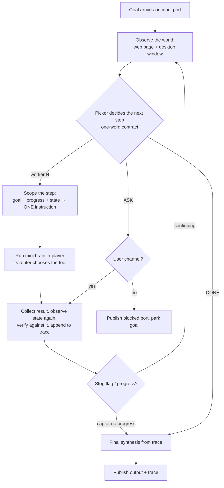

- **Three inputs to every decision** — the GOAL, what WAS DONE (the step result and the trace) and **the world NOW** (the observed state digest). A result is the brain's own prose: it reads *"opened LinkedIn"* whether or not anything moved, so the digest is what lets the model *confirm* a step instead of assuming it (measured 2026-09-23: a failed web sequence reported success, Laya verified it, and the loop closed as done). The digest is one read per iteration, shared by the chains gate, the picker, the scoper and the verifier; sources are optional and read-only — the chain's own live browser page (URL, title, visible text with shadow roots and frames, never launched, never navigated) and the desktop foreground window (title + process). Empty when nothing is observable; `LOOPER_ORCH_STATE=off` disables it.
- **Workers** — mini brains are the unit of dispatch; each brain's runtime-derived description (chain description + `[inputs: …]` + a router brain's `[tools: …]` names as context) is what the picker chooses on. A worker may be a whole chain (`chain_import` on `brains`) **or a single node** (sequence, web sequence, conditional, code, LLM, form filler, handle, MCP): the node's own **description** field is then the routing text (its label + type + one structural hint otherwise), and a conditional worker evaluates once and publishes its verdict — a *check* step, never branch navigation.
- **Picker** — `llm` (one strictly-parsed token: worker number, `DONE`, `ASK`; one stricter retry) or `laya` (done-probe + worker-only choice + conservative ask via the embedded engine; zero parsing). Either way, unparseable → stop with the trace as the answer; no prose scanning.
- **Step scoping** — after the pick, one short turn turns the covered scope + progress + the observed state into ONE imperative instruction (`Your next step: …`): the orchestrator scopes, the brain picks the tool. The worker's prompt is its **MISSION** (the task(s) inside its scope) plus progress — the original request never rides along. When that turn yields nothing, the description-as-task prompt is used (previous behavior). **Scope integrity**: a scope that silently DROPS one of a compound directive's actions is refused (the dispatch does not happen, the directive is handed back) — measured 2026-09-24: the scope *"Open LinkedIn.com and click on your network."* cost the request its `home` action. Single-action directives are not policed this way — paraphrasing (`home button` → *the house icon*) is the scoper's job.
- **Verification looks at the world** — the per-step verdict's premise carries the step result **and** the state digest, and a step the executor reported as failed (it returned no next node — the same convention the main loop turns into *"Node X execution failed"*) is `ok=False` without a scorer forward.
- **Guards** — step cap (default 15), no-progress detector (identical worker + identical step + identical result twice), stop flag checked between steps; sub-brains run through the normal chain-import path with `_chain_input_context` carrying goal + progress **plus the propagation packet** (`_chain_root_goal`, `_chain_plan`, `_chain_state` — see the handback contract in 10.3). An unresolvable chain import (no path, or the file is gone) now **fails the node** instead of skipping ahead — a run of broken imports used to log ERRORs and still report success end to end (measured 2026-09-23).
- **Synthesis** — one final short LLM pass turns the trace into a plain-language answer (the rendered trace is the fallback). The full step log is published on the `trace` port; `blocked` marks a goal parked for the user.
- **Composition** — mini brains are ordinary chains (they never run standalone); `chains/ORCHESTRATOR.json` wires the router brains and every brain file is loaded from disk at dispatch time. Removing the orchestrator file leaves agent mode with the remaining System chains — or the explicit "No system chain loaded" error when none exists; routing never falls back to a hidden classifier.
- **Steering a worker** — the scoped step arrives as `Your next step: …` alongside the goal and progress (carried verbatim on an entry **carry** input), while an **`agent_modifiable`** input runs one extraction turn that pulls its single parameter (query, item, filter…) out of that prompt — its **label** is the filter. To build one: add an Input node, set its label to the parameter it should supply (e.g. *Search query*), tick *agent-modifiable*, forward it downstream. Two budgets to know: the extraction sees the parent context capped at 500 chars per input (the goal comes first, so it survives — keep long briefs on a carry input and let agent-modifiable inputs own the parameters), and in manual runs without an agent session agent-modifiable inputs behave as carries, so the brain still executes.

### 10.3 Deterministic chains — the `chains` port and the freeze loop

The orchestrator's second input port carries **deterministic chains**: orchestrator-free compositions that answer a known request end to end with **no routing inference**. One rule decides which kind a chain is — *does it contain an orchestrator, directly or through its imports?* — and that same rule drives the port it may be wired to, its node color (`import_kind`), and what may be frozen.

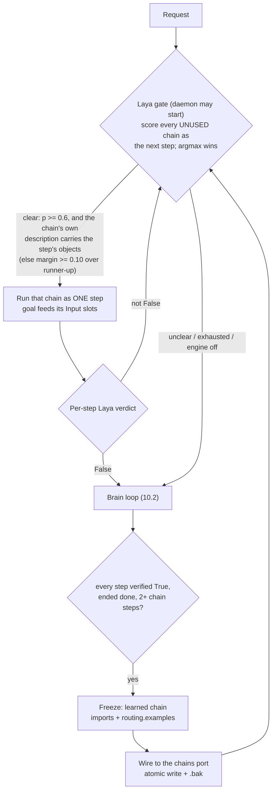

- **The port is a selector, not an executor.** A deterministic hit runs through the same chain-import path a brain uses (`_chain_input_context` carries the goal); the fast path adds only the router stage, so execution semantics are unchanged.
- **The ladder is applied per level, recursively — brains hand lists to brains.** At every orchestrator: (1) *can ONE chain do the WHOLE job?*; (2) if not, *which brain may be able to?* — a brain that is **itself an orchestrator** receives the **tasks its description covers** as one dispatch: the consecutive directives that the same typed question ("which worker serves this step?", asked per directive) assigns to it — **never the whole request** (a 40-page goal must not ride into every instance; each worker gets the scope it needs), and it re-runs this exact ladder at its level: whole-chain → its own chains per directive → *its* brains. **Brains are OPTIONAL at any level**: a level with zero brains is a legitimate shape, never a crippled one — brains are the dynamic processing (a brain *learns* something new), the chains port is the mechanical worker, and the successful run is later frozen into a learned chain: the cerebellum records what the brain learned. A sub-brain level may be added to — or left out of — any part of the tree, in any amount, without implying that level's chains cannot do the work; when a chains-only level truly cannot serve a step the log says exactly that ("this step is unserved at this level"), never that brains were required. A **specialist** chain (no orchestrator inside) keeps the one-step contract: the orchestrator scopes ONE directive and the specialist routes it to a tool. A verified delegated list completes the whole remaining span. When a nested brain comes back with work unaccomplished it appends a machine-readable **handback** to its published output — `[ORCH-REMAINING] ["…", "…"]`, only on relayed runs, never on a top-level answer — and the parent **advances past the prefix that WAS accomplished** and re-routes only the untouched tail (a report that does not line up with the parent's span is ignored), excluding that brain for the span until other routes were tried. The contract is **two-way**: *marker absence means the sub-run ended `done`*, so the whole delegated span is complete by construction and the parent completes it structurally — no probe, no re-dispatch (measured 2026-09-24: without that signal the parent had no way to know the delegated work had finished and kept routing). And a reported remainder **overrides the verify read**: a sub-brain that explicitly says what it could NOT do is never treated as done, even when the scorer reads True. The recursion is bidirectional. Beside the marker rides `[ORCH-OUTCOME]` — a JSON object with the child's `stop_reason`, its last ≤8 step records and its observed state; the parent strips it from the prose and records it on the trace entry (`outcome`) for inspection — observability only, never a routing input.
- **The ladder decides routing, per activation.** First: *is there a LEARNED chain that does this job?* — a deterministic, scorer-free match (measured 2026-09-24: the neural version of this rung picked an **atomic** chain as "the whole answer" — 0.869 vs the learned chain's 0.765 — and the state digest flipped the order again), judged on **intent coverage, not verbatim text**: the artifact's COMPOSITION is expanded at routing time (each step's name + description, in order — "1) go to linkedin — navigates to linkedin.com on chrome; 2) messages — clicks on the messages button"), every step's salient word must be asked for and every requested action must belong to a step. A request covering only part of the artifact (it would execute a step nobody asked for) or more than it (an action would be left undone) is refused *with the exact gap in the log* (`steps nobody asked for: …` / `actions no step serves: …`) and falls to the step ladder. Second: the goal is **listed as its steps by one planning turn** — the LIST is the model's work, and the *protocol* is what makes a 1B-class model able to do it: one short question ("list the steps this request is made of, in order"), one step per line, verb-first with a worked shape example, nothing else — measured live 2026-09-24 with SmolLM3 on the request that used to fail: `navigate to linkedin, click on my messages, then on my network and then press the home button` → `navigate to linkedin` / `click on my messages` / **`click on my network`** / `press the home button` (the model itself supplied the elliptical verb). **Nothing here ever cuts the request**: a regex split into fragments is what disconnected a step from its chain — the verbless piece `on my network` read 0.578 against the tool "clicks on my network button", fell under the floor, and the action stayed unserved while the named one read 0.641. What the code does instead is *validate* the reply: reasoning blocks dropped, numbering/bullets/shape cleaned character by character, narration and request preamble dropped, lines capped (`_ORCH_DIRECTIVE_CHARS`), duplicates collapsed by object across the whole plan, plan capped — and a reply that cannot be a plan (the request joins clauses but ONE line came back — see `_orchestrator_looks_compound`) is asked once more with the protocol's example. A reply that is still one line stands as ONE directive and the ladder's picker / scoper / done-probe own it, exactly as when the planning turn is unavailable. Two deterministic shortcuts remain, both because the input is *already* discrete: the numbered/bulleted **handoff list** a parent level writes is read line by line (its lines ARE steps — re-planning one is how a clean four-item list lost `jobs`), and a **verbless line** is completed by grammar (`_orchestrator_inherit_verbs`: a step opening with a function word continues the action before it, `click on my messages` + `on my network` → `click on my network`; `press the home button` keeps its own verb).
- **A partial fit is ASSEMBLED, not re-derived.** When no artifact covers the request but its PARTS do, the plan picks one deterministic **unit** per consecutive run of directives — a whole learned artifact first (its composition covers that span exactly), else one of its step files, else an atomic chain on the port — materializes them as ONE continuous chain (`.pending_` name) and runs it as the whole answer: one dispatch, zero scorer reads. The plan must contain an artifact: a plain atomic sequence stays on the per-directive path, which verifies every step separately and freezes the same variation at the end anyway. A verified assembly is renamed into `learned_…` and **wired as the new learned artifact for that variation** — learned chains composed of learned chains, not only of atomic tools; a failed verification deletes the pending file and the ladder takes over (an unverified run is never persisted). Ambiguity is never a guess — two candidates for one run decline the whole plan. Measured 2026-09-24 on the real library: `['open linkedin', 'click my network', 'click my messages', 'click jobs']` → `[the 3-step artifact, jobs.json]` ✓, `['click the button']` (two descriptions contain it) → no plan ✓.
- **The gate asks the step question — a chain may serve SEVERAL steps, learned artifacts never appear here.** The port is the human's action space: every wired chain (except learned artifacts) is scored for the directive, one `noul` forward each, judged against the CURRENT DIRECTIVE (never the compound request): *"The next step toward the goal is to `<description | routing.examples>`."* Alignment comes from the **floor `_CHAIN_GATE_MIN = 0.6`** plus the human description itself: the candidates whose description **names at least one object the step names** form the pool, the best neural score in it wins, and a pick that names **more objects than the runner-up** is CONFIRMED (`margin` irrelevant). Measured live 2026-09-24 on the 7 wired chains, both directions: `click on my network` read 0.641 against the tool "clicks on my network button" while an unrelated chain read 0.620 (margin 0.021 — a perfect match the margin alone declined), and for `press my network button` the scorer picked the WRONG chain by 0.001 (home 0.656 vs `clicks on "my network" button` 0.655) while only the right chain named the step's object. A tie in objects named is real ambiguity and `margin >= _CHAIN_GATE_MARGIN = 0.10` over the runner-up decides. Correct picks measured 0.625–0.81, the tiny model's noise band at or below ~0.51 (measured 2026-09-24: `messages` read 0.506 for a home-button directive and ran while the floor was 0.5) — a miss costs one brain round, a false positive runs the wrong chain. **A chain is not one action**: after a verified step the plan advances by the SPAN that chain's own description names — a routine chain ("opens linkedin and clicks on messages") serves several consecutive directives without per-action routing, a step-sized chain advances exactly one, and the count is computed, never assumed. Learned chains are excluded entirely (one scored 0.756 because its example IS a goal text). **Discovery stays at the current level** — an orchestrator learns its own chains and brains, and a brain's description surfaces only what it ROUTES WITH (`tools` / `brains` ports, one level at the boundary); a nested orchestrator's deterministic `chains` is that level's own action space (learned artifacts keep accumulating there) and is never flattened upward, or a deep agent (3 brains per level, ten levels) would OOM its context before it ran. The OBJECT comparisons around the gate (plan dedupe, learned composition coverage, assembly units) assume **no vocabulary at all**: the library classifies its own generic terms from the wired chains' signals — a word many chains share names no object for that library (`click`, `button`, `page` in an English UI set) while a word only some carry does — and plurals/third-person are stemmed as language glue. Rename a chain, add a language, rewire the port: the classification follows the data.
- **A verified step advances the directive; a completed plan ends the run.** When a step's verdict is True the next directive becomes the routing unit (its own steps are its progress). Once **every** directive of a real decomposition was executed and verified, the level ends `done` structurally: the plan IS the goal decomposition, so covering it covers the goal — the picker, the scoper and the done-probe are never consulted for work to invent (measured 2026-09-24: on a fully achieved LinkedIn goal the done-probe read 0.394 on a steps-only premise and the scoper then fabricated *"select 'Send a Message'"* for `jobsearch`, which ran and looped until ESC). The probe keeps its role while the plan can still be unfinished: mid-plan, and for an **unsplit** plan — a single directive that echoes the goal, the planner's *already one action* / *could not split* answer — where the picker / done-probe ends the run exactly as before (a multi-step goal like *"find the cheapest monitor"* still loops past its first verified step).
- **Laya is a burst resource** (`LOOPER_LAYA_KEEP_ALIVE_SECONDS`, see 15.2) — the daemon is normally unloaded between steps, so the gate **starts** it (~2 s) when a chain set is wired; a machine with the engine disabled for the session (kill switch / no exe / no model) keeps the fast path closed without probing.
- **A step the node itself reported as failed is never dressed as success.** Node executors return the next node id on success and `None` on failure (the same convention the main loop turns into *"Node X execution failed"*); the orchestrator records `Outcome: FAILED (<type>) — the node aborted before completing` and the trace's `ok` is False without paying a scorer forward. (Measured 2026-09-23: a failed web sequence used to report *"ran successfully"*, Laya verified it True, and the loop closed as done.)
- **Per-step verification** — after every dispatched step (brain or frozen chain) one Laya forward answers *"did this step accomplish what it was asked?"* and the verdict rides on the trace as `ok` (True / False / None when the engine is down). Its premise includes the step's result — unlike the goal-level done-probe, which judges from steps alone because result prose reads as a completed claim. `picker=laya` runs and the fast path may relaunch the engine for the verdict; a `picker=llm` run keeps the no-launch rule.
- **The freeze is data, not weights.** A run compiles into a learned chain only when it ended naturally (`done`, never after ESC/stop), **every** step verified True, every step was a library chain, and there were at least two steps (a single step *is* the library chain). The artifact is **composition-only** — one `chain_import` per step, `input → imports → output`, plus a `routing` block (verbatim past requests, provenance, counters) — so a library fix propagates to every learned chain and the file stays tiny. Two guards keep it honest: one artifact per goal (a repeat run rebuilds its own file instead of piling up timestamped twins), and the source chain must **host this orchestrator** (its id must be in that file) or the freeze is skipped — the artifact never lands in a chain that never ran it. **The artifact describes itself in steps**: each step's description is read from the atomic chain it imports and persisted with the artifact (`steps[]` + a step-wise `description`), so the orchestrator judges what it DOES without opening a file (and a later artifact that composes this one inherits that step list as its step description). Artifacts and host-file edits are written as **pure-ASCII JSON** (non-ASCII escaped) and the chain editor reads/writes chains as UTF-8 — measured 2026-09-24: a single `→` in a learned description plus a locale-codec load made the file (and a chain with an em dash) unloadable in the editor, which looked like a broken orchestrator. The wiring target resolves the orchestrator's id the way the builder stores it (`data.node_id`; a built orchestrator node carries no top-level `id`) — reading only `node['id']` left every learned chain on disk but unwired.
- **Routing signal is requests, not prose** — `routing.examples` holds the verbatim request text of successful runs (≤5 × 200 chars) and is the criterion text the gate's step read is made on; the prose `description` stays for humans and the rating/description-repair loop. A chain with neither is skipped with a warning — no signal, no route.
- **Slots stay open** — goal-varying values remain bound through the `agent_modifiable` Input nodes of the library chains; the freeze never bakes the learning run's values in.
- **Where it lives** — `chains/learned/learned_<stamp>_<slug>.json`, wired automatically into the running chain file (atomic write, one-time `.bak`, never twice). Frozen builds write and resolve under the runtime dir. `LOOPER_LEARN=off` disables the freeze; without the Laya engine the fast path stays closed and the loop handles everything.
- **Authoring surfaces** — sequence, web sequence and conditional dialogs carry the **description** field the picker routes on (code nodes and the orchestrator already had one; the handle node uses its goal description), and chain-import nodes are painted by `import_kind`.

### 10.4 Input node v2 — interaction gates

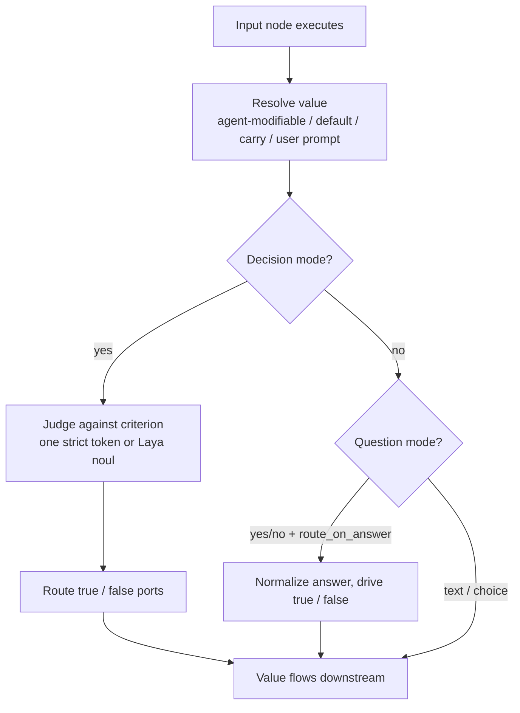

- **Decision mode** — a natural-language criterion evaluated with one strictly-contracted model turn (reasoning strips, single-token answer, one stricter retry, fail-closed default) or the Laya noul evaluator (zero parsing). This replaces brittle Input+Conditional pairs.
- **Question modes** — free text, yes/no, or a choice list (`[{label, value}]` pairs); answers are normalized against the options (exact label/value, case-insensitive; one re-ask, then default).
- **Accepted media** — `accept_text` / `accept_images` / `accept_documents`; documents are text-extracted (PDF/Word/txt), images contribute their path; attachments ride the `data` port payload and a `node_<id>_files` side channel into downstream code nodes.

### 10.5 Persistent goals (wake-driven)

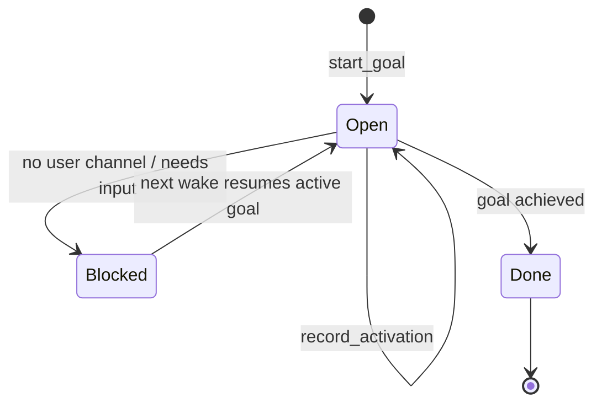

- `player/agentic_ops/goal_ledger.py` — atomic tmp+replace writes to `LoOper/data/agent_goals.json`; corrupt-safe load; a single active goal; per-activation trace records.
- Enable `use_goal_ledger` on the Orchestrator: a blocked goal parks itself (`blocked` port) and **resumes on the next activation** — wake-driven persistence, not a busy daemon. Schedule the chain to create the wakes (see §13).

### 10.6 Agent surfaces

- **Chat overlay** — a floating rounded overlay (toggleable) and a full workspace (`File > Agent`), chat bubbles with transcripts per named agent, stop/ratings, voice mode.
- **Phone client** — the chat is served over LAN/Tailnet with a scannable QR; runs started from either surface are answerable and stoppable from either; history syncs on reconnect.
- **Exported agents** — any system chain can be compiled into a standalone `.exe` (see §14) with the agent surfaces intact.

### 10.7 Routing diagnostics — derived action graph & plan projection

Two log-only shadows render what routing *could* go on; nothing dispatches on them yet.

- **Derived action graph** (`…/executor_modules/action_graph.py`) — per chain file, a typed graph built from what the EXECUTOR actually reads, never from descriptions: web-sequence actions render verb + the locator's literal text (`click "Easy Apply"`), plus sequence names, handle goals, and input/llm/conditional/mcp/form/code labels. Label-less nodes are skipped and counted (the coverage number is honest, not padded). Edges are the executor thread (output connections; tool ports excluded) with a deterministic order; chain imports collapse ONE level (`jobs: click "Jobs"`), cycle-guarded. Graphs are content-hash cached — rebuilt only when a file's bytes change — and bare web-sequence refs only resolve inside files carrying `mode: web` (a chain sharing the sequence's name must never win).
- **`Action graph (shadow)`** — per activation, per wired worker: coverage (`rendered/nodes`), skipped kinds, entity lines and `-> call "…" (k child line(s))` imports. A worker that renders `0/N` has no own executable payload — its routing rests on its description and its imports' child lines.
- **`Plan projection (shadow)`** — every planned directive matched against the wired workers' candidate lines (own entities + one-level import children) with the picker's own stemmed vocabulary (verb and ambient state words excluded): `directive -> worker: line (shared: …) | UNMATCHED`, closed by `(projection: k/n directive(s) matched at least one action line)`. UNMATCHED names intents no wired action covers — bad plan wording, a missing capability, or an unnamed chain; the matched count is the funnel metric behind most "wrong brain" runs. Measured on the current library (2026-09-26): the observation-plan of a "what is in the website i opened?" request matched 1/3 directives.

Both blocks ride at INFO and are silenced with `LOOPER_ORCH_GRAPH=off`. The projection is the measurement substrate for the planned planner work.

---

## 11. Memory & context

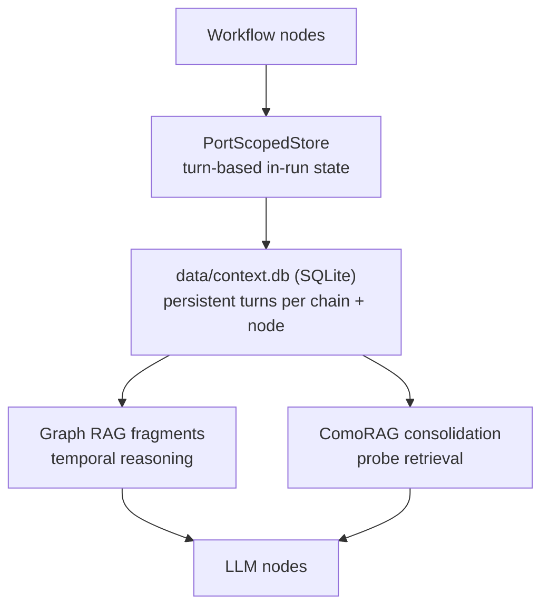

- **In-run state** — the PortScopedStore keeps named-port values plus a turn-based history (user turn, tool turn, result) per chain; `clear_on_finish` context nodes are scoped to exactly one execution run.
- **Persistence** — Context nodes write to `context.db` (`AI/context_database.py`): append-only turns with per-(chain, node) rolling caps, cross-chain sharing, and merge policies.
- **Retrieval** — Graph RAG surfaces relevant past knowledge to reasoning nodes; ComoRAG consolidation distills large sources into grounded facts via probe-retrieval cycles (§9.3).
- **Consolidation** — LLM nodes with `use_context_consolidation` enable a probe-driven memory-organization loop; turn history is trimmed to `max_history` with amortized counters.
- **Inspection** — the Agent Settings dialog renders a goal-relationship graph with tabbed panels for executions and feedback: memory is reviewable, correctable, clearable.

---

## 12. Specialized subsystems

### 12.1 Form Filler node

Document-grounded multi-field completion: field discovery on live pages/apps, knowledge-file lookups (including learned ask-user answers), per-field validation, page-rejected field repair loops, and a review gate before submission. Choice controls (select / combo / merged radio-checkbox groups) are resolved by the **Laya** semantic picker — every option is scored against the value the model meant, and the pick is taken only when it clears a confidence floor and a margin over the runner-up; an unclear pick is refused so the field is **asked** instead of guessed. A **list-backed** control is never skipped on a pre-filled value (a `<select>` rests on its first option), so a page default is corrected from the context and the field is only rewritten when the answer differs; a text field the page already filled stays untouched. Fact composition parses composer findings in every form a small model emits (bare / markdown-bolded / numbered) and keeps only findings traceable to the retrieved excerpts. Its ask-user path keeps the legacy callback signature — fully compatible with the ask-user v2 channel.

### 12.2 Handle node (vision grounding)

Combines VLM scene understanding (LFM2.5-VL) with LLM reasoning to issue grounded click/scroll/zoom/key actions on screen content that lacks selectors — vision-reasoning-action for arbitrary UIs.

### 12.3 MCP node

Connects Model Context Protocol servers as workflow nodes; discovered tools are exposed to the router model as individually selectable actions (same name-only selection contract as chains).

### 12.4 Code node & Code Node Studio

Inline or file-based Python with JSON arguments and output variables; runs pure-Python execution with strict outputs. The Code Node Studio provides an editing panel with an Aider-style iterative local-agent loop for authoring code inside the graph.

---

## 13. Scheduling, sandbox & remote access

### 13.1 Scheduler

`NGUI/scheduler_service.py` runs any chain on a schedule — **once, daily, weekly, interval** — with enable/disable, next-run display, and run-now. Schedules persist to `schedules.json`; execution is **in-process** through the same `MultiSequencePlayer` path as manual playback. Schedule wakes are also what resume persistent goals (§10.5).

### 13.2 RDP sandbox

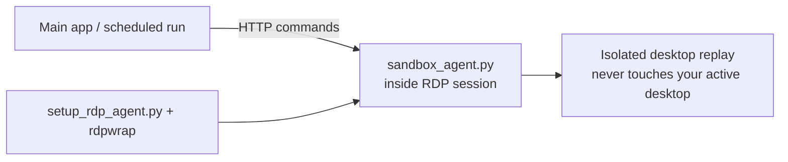

Automation runs inside an isolated Windows session via a local HTTP agent; the desktop you are using stays untouched. Chains can opt into sandbox mode (`run_in_sandbox`) per sequence/chain-import.

### 13.3 Remote access

- The agent chat is served over LAN or Tailnet (Tailscale IP) with a QR code — a phone can drive runs, answer ask-user questions, and stop executions.
- Remote clients receive the same busy lifecycle, transcripts, history sync, and pending-question replay as the desktop overlay.

---

## 14. Export & build pipeline

### 14.1 Standalone agent export

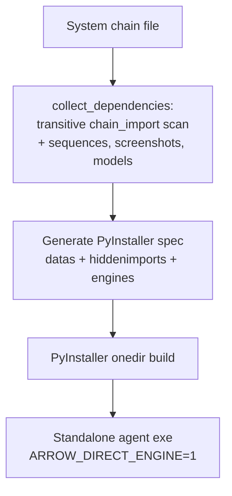

- `builder/agent_exporter.py` resolves every chain referenced transitively (including orchestrator brains), bundles chains/sequences/models, and builds a one-folder executable.
- Exported agents run **directly on the local engines** (`ARROW_DIRECT_ENGINE=1`): no FastAPI dependency, fully offline; in frozen builds without the engine, Laya paths degrade to LLM automatically.

### 14.2 Application build (MSI)

`build_pipeline/` drives the product build: dependency staging (llama.cpp binaries, Chrome, model files), PyInstaller via `LoOperApp.spec`, runtime hooks for ONNX Runtime/torch, WiX source generation (`generate_wxs.py` → `arrow.wxs`), and `build_msi.ps1` producing the per-user MSI with custom UI and EULA.

---

## 15. Configuration, environment & data

### 15.1 `AI/config.json` (key entries)

| Key | Meaning |
|---|---|
| `LLAMA_CPP.model_path` | Default GGUF for LLM nodes |
| `LLAMA_CPP.embedding_model_path` | Embedding GGUF |
| `LLAMA_CPP.gpu_layers` / `threads` / `context_size` / `batch_size` | Engine tuning (0 = model defaults) |
| `API_PORT`, `AUTO_START_API` | Local API control (default 8000 / true) |
| `OLLAMA_HOST`, `OLLAMA_PORT` | Ollama endpoint |
| `AGENT_TAILSCALE_IP` | Remote agent access address |

### 15.2 Environment variables

| Variable | Purpose |
|---|---|
| `API_PORT`, `AUTO_START_API`, `API_TIMEOUT` | Local API networking |
| `OLLAMA_HOST`, `OLLAMA_PORT`, `OVERWATCH_API_URL` | External service endpoints |
| `TAILSCALE_SERVER_IP`, `AGENT_TAILSCALE_IP` | Remote access |
| `LOOPER_AGENT_PORT` | RDP sandbox agent port |
| `LOOPER_LAYA` | `off` forces all Laya consumers onto LLM paths (`LOOPER_JEV` honored as the legacy name) |
| `LOOPER_LAYA_MODEL`, `LOOPER_LAYA_THREADS`, `LOOPER_LAYA_EXE` | Quant override (name or path) / CPU worker count / engine binary override |
| `LOOPER_LAYA_KEEP_ALIVE_SECONDS` | Grace after the last request before the scorer is unloaded (default `2`; negative pins it resident). The daemon is a **burst** resource — released before every llama-server start so the two models never fight for one memory pool |
| `LOOPER_ORCH_STATE` | `off` disables the orchestrator's per-step state digest (web page + desktop foreground window) — the loop then decides from goal + results alone |
| `LOOPER_ORCH_GRAPH` | `off` silences the orchestrator's routing shadows (derived action-graph block + plan projection) — diagnostics only, nothing routes on them |
| `LOOPER_LEARN` | `off` disables freezing verified runs into learned chains (the `chains` port keeps working) |
| `LOOPER_RUN_MEMORY`, `LOOPER_RUN_MEMORY_DB` | `off` disables the agent activity timeline (`data/run_memory.db`); DB path override for tests / portable installs |
| `OPENJEV_*` | Legacy openjev overrides (archived pre-Laya tooling in `utils/openjev/tools/`) |
| `LOOPER_GOAL_LEDGER` | Override goal ledger path |
| `ARROW_SESSION_ID` | Unified telemetry session id (subprocess log merge) |
| `ARROW_DIRECT_ENGINE` | `1` in exported agents: direct engines, no API calls |
| `KMP_DUPLICATE_LIB_OK`, `FLAGS_use_mkldnn`, `FLAGS_enable_mkldnn` | Native library compatibility shims |
| `YOLO_AUTOINSTALL` | Disable ultralytics auto-install |
| `QT_ENABLE_HIGHDPI_SCALING`, `QT_AUTO_SCREEN_SCALE_FACTOR` | High-DPI behaviour |

### 15.3 Data persistence

| Data | Storage | Location |
|---|---|---|
| Chains | JSON | `LoOper/chains/*.json` |
| Learned chains | JSON (composition + routing) | `LoOper/chains/learned/*.json` (runtime dir in frozen builds) |
| Desktop sequences | JSON | `LoOper/sequences/*.json` |
| Web sequences | JSON | `LoOper/web_sequences/*.json` |
| Context memory | SQLite | `LoOper/data/context.db` |
| Schedules | JSON | `schedules.json` |
| Goal ledger | JSON (atomic) | `LoOper/data/agent_goals.json` |
| Run memory (activity timeline) | SQLite (WAL) | `LoOper/data/run_memory.db` (durable runtime dir in frozen builds) |
| TTS/STT models | ONNX / Vosk | `LoOper/data/piper_voices/`, `LoOper/data/vosk_models/` |
| Logs | text | `logs/session_*.md`, `automation.log`, `run.log` |

### 15.4 Logging

Unified telemetry: a root logging dispatch fans every record out to the colorized console, `automation.log`, and a per-session markdown log (`logs/session_*.md`) — including records from subprocesses (API, engines) that join the parent session by id. Long model outputs are written as titled log blocks instead of inline blobs.

---

## 16. Engineering doctrine (methodologies)

These are the load-bearing design principles the codebase is held to; they explain most of the “why” behind the implementations above.

1. **Neuro-symbolic execution.** The graph is a deterministic program. AI is used only where fuzzy judgment adds value — never as a single point of failure for micro-decisions. Every AI touchpoint has a symbolic fallback or a fail-closed default.
2. **Small-model discipline.** Every model interaction is shaped for 1–4B models: stepped protocols (pick a name, then extract one field at a time), strict single-token contracts, reasoning-tag stripping instead of prose parsing, bounded retries, and prompts sized to the model window.
3. **Named-port contracts, no implicit state.** Values move only along explicit edges; ports are named and namespaced per chain. What a node does is decided by topology + configuration, never by its position in the graph.
4. **Runtime-derived descriptions, never persisted.** Tool descriptions are generated from chain metadata and inputs at call time, so editing a chain instantly changes how the model sees it — there is no stale description cache.
5. **Fail-closed defaults, byte-identical off states.** New capabilities ship as default-off toggles; chains that do not use them behave exactly as before. Unparseable answers route to configured defaults (e.g. decision default = false) and log loudly.
6. **Entity-first grounding over coordinates.** Web replay resolves recorded entities via stable selectors (never absolute coordinates); desktop replay tries the recorded UIA element before image templates. Two independent locators beat one clever matcher.
7. **No timeouts on local model execution.** Long inference is legal; interruption is a stop-flag concern. Timeouts are reserved for network-ish edges with retry policies.
8. **Serialized, on-demand model lifecycle.** No model preload at startup; one shared engine with a serialization lock; burst-aware cleanup; RAM-aware context sizing (the engine, not the request, owns the effective context).
9. **Approvals and memory are primitives, not features.** An approval is an Input question plus branch routing; memory is Context nodes plus an inspectable SQLite store. Users compose them; the platform does not hardcode policy.
10. **Offline and telemetry-free.** All inference, storage, and licensing work without network access; nothing leaves the machine.
11. **Everything inspectable and reversible.** Execution logs, memory panels, trace ports, blocked states, and rated outputs give the operator a full audit surface — and ESC always aborts.
12. **Test discipline.** Non-trivial logic leaves a runnable check behind; behavior-affecting changes land with regression tests (see §17), and UI logic is testable headless via offscreen Qt.

---

## 17. Testing & verification

- **Framework** — pytest under `LoOper/tests/` (~80 test modules, ~1,900 tests collected as of the current tree) plus standalone unittest harnesses for subsystems with special lifecycles (e.g. execution skip/loop regressions).
- **Headless UI** — Qt tests run offscreen (`QT_QPA_PLATFORM=offscreen`) with lightweight fakes for graph views and overlays; overlay/bg-thread flows are exercised with stub web servers and message capture.
- **Execution semantics** — the skip/loop regression harness covers branch sweeps, convergence, loops, decision routing, and tool-provider gating; graph fixtures are built exactly like the player builds them. The orchestrator suites (node in `tests/test_orchestrator_node.py` — including the propagation packet and the shadow blocks — the derived substrate in `tests/test_action_graph.py`, assets in `tests/test_orchestrator_assets.py`, gating in `tests/test_tool_provider_flag.py`) cover node brains, the `chains`-port gate and fast path, the freeze gates, and a shipped-asset classification sweep; `tests/test_chain_config_encoding.py` pins the chain editor's UTF-8 load/save round-trip (locale-codec reads mojibaked non-ASCII and crashed on bytes cp1252 leaves undefined).
- **Isolation** — tests use temp trees and monkeypatched roots (config, exporter, ledger) so nothing touches real user data.

Run the suite:

```bash
python -m pytest LoOper/tests/ -q
```

---

## 18. Repository layout

```
LoOperV2/
├── LoOper/
│   ├── main.py                  # GUI entry (delegates to NGUI/app.py)
│   ├── NGUI/                    # PyQt5 UI: editor, dialogs, overlays, panels, scheduler
│   ├── player/                  # Execution engine, recorder, web recorder/replay, grounding
│   │   ├── multi_sequence/      # Interpreter (builder, navigator, executor_modules/*)
│   │   ├── agentic_ops/         # System-chain agent runtime (router, chain executor, run memory, goal ledger, description repair)
│   │   └── web/                 # CDP recorder, replay engine, handlers, inject scripts
│   ├── recorder/                # Desktop recorder (mouse/keyboard/scroll/screenshot)
│   ├── AI/                      # FastAPI server, engines, embeddings, RAG, Laya engine, models, bin
│   ├── builder/                 # Standalone agent exporter + standalone entry
│   ├── chains/                  # Chain workflows (incl. system chains and demo brains)
│   ├── sequences/ web_sequences/ data/  # Recordings, context.db, models, voices
│   └── tests/                   # Pytest suite
├── build_pipeline/              # PyInstaller spec, WiX MSI generator, PowerShell build scripts
├── keygen/                      # Offline license generation/validation
├── utils/                       # Vendored engines and toolkits (llama.cpp, ComoRAG, nano-graphrag,
│                                #   openjev (checkpoint + archived pre-Laya tools), aider, little-coder, rdpwrap, playwright-mcp, …)
├── docs/                        # User guide, business analyses, compatibility docs
├── runtime/                     # Runtime shims
└── tests/                       # Standalone harnesses (execution skip regressions, …)
```

---

## 19. Licensing & distribution

- Individual use is free: every automation feature and node type, no execution limits.
- License files are **offline HMAC-signed and hardware-bound** (`keygen/`); no activation servers.
- The enterprise right is **agent export** — compiling a complete agent (system chain + transitive assets) into a distributable executable.
- The packaged MSI installer (WiX) is the recommended path for end users; source runs use `LoOper.py` / `run_looper.bat` (see the root `README.md` for install steps and product overview).

---

*This document describes the current implementation, including the Orchestrator goal loop, Input node v2 interaction gates, the embedded Laya decision engine, and the goal ledger. It replaces the legacy README that predated the chain-import, agent-mode, web-automation, and memory subsystems.*
